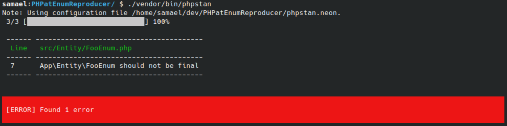

# PHP Architecture Test - Final enum reproducer

This package is a reproducer of a bug in `phpat/phpat`.
When testing classes in a specific namespace are not final, PHPat throws an error if an enum is in that namespace.

[Github Issue](https://github.com/carlosas/phpat/issues/220)

## Installation
After cloning this repository, install the Composer dependencies.

```shell
composer install
```

## Usage
```shell
./vendor/bin/phpstan
```


